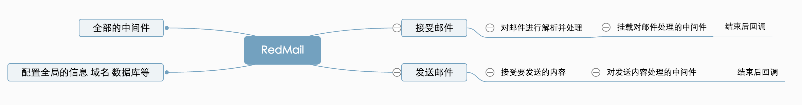

# RedMail - 一个适合私人使用的邮件服务器
---
# 服务器后端开发
- stmp 接受 模块 暂选 smtp-protocol
- stmp 发送 模块 暂选 nodemailer
- stmp 邮件内容解析 mailparser
- pop3 推送 pop3-n3
- imap 推送 imap-server
- imap 拉取 imap
- 数据库储存 moogose

- 配置信息 模块
- 工具类

---

# web端 界面
